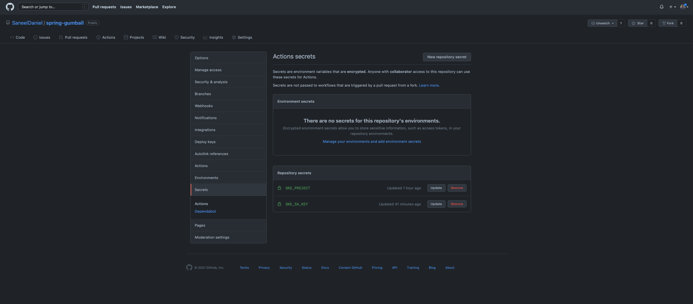
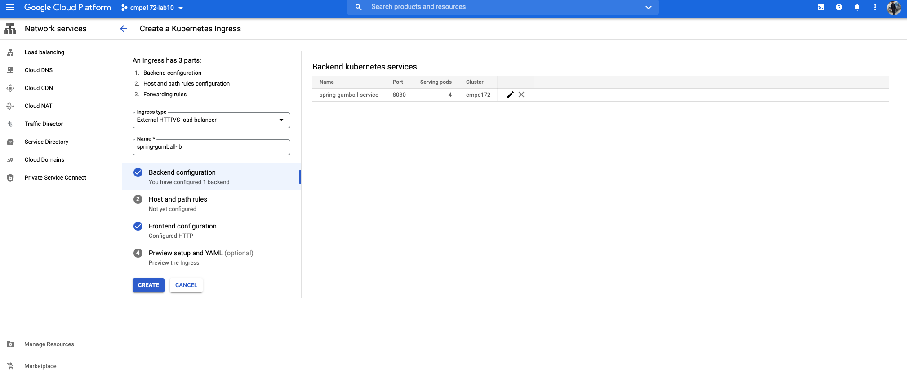

# spring-gumball ci/cd example

In this lab, I explored how to setup a CI/CD pipeline with github actions, and Google Cloud Platform.

It is especially interesting to see how easily the workflow can not only be managed, but also tested, and deployed with such a pipeline.

The automation tools and the templates provided by github are also quite impressive.

## CI Workflow:

- Set up the CI workflow action to be triggered on push to the main branch.
- It attempts to build the jar file, and on successful completion, it uploads the file.

### Screenshot (CI Workflow)

  

## CD Workflow

### Screenshots

- GCP Service Accoucnt & JSON Service Account Key

  

- GitHub Action Secrets

  

- GKE Cluster

  

- V2 Github Release

  

- All Github Workflows

  

- Build & Deploy Action Workflow

  

- GKE Workload

  

- GKE Ingress

  

- GKE Ingress Details

  

- Gumball Live

  
